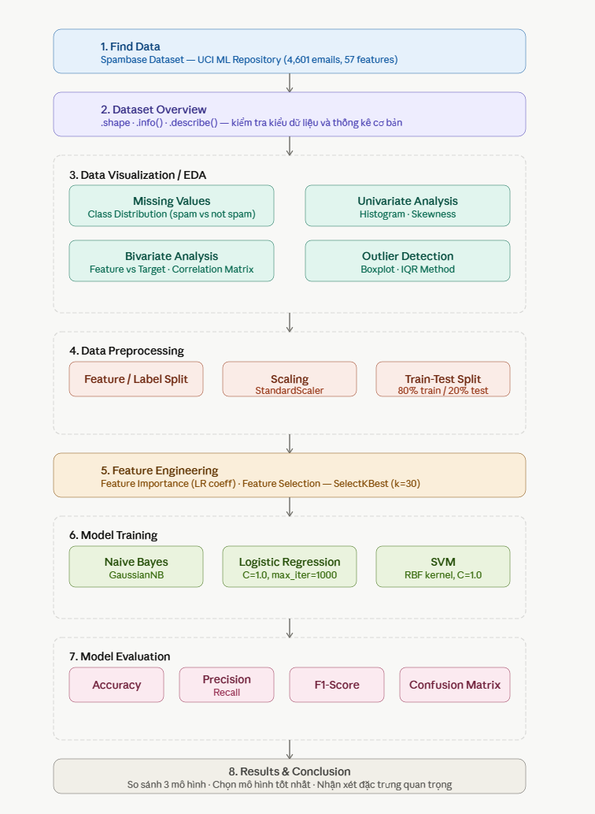

# BÁO CÁO: PHÂN LOẠI EMAIL SPAM
## Dataset: Spambase - UCI Machine Learning Repository

---

## 1. Tìm kiếm dữ liệu
- Sử dụng dataset Spambase từ UCI ML Repository
- 4601 email, 58 cột (57 features + 1 nhãn)
- Nhãn: 0 = Ham (không spam), 1 = Spam

---

## 2. Tổng quan về tập dữ liệu
- Shape: (4601, 58)
- Không có giá trị thiếu
- 55 cột float64, 3 cột int64

---

## 3. Khám phá dữ liệu (EDA)

### Phát hiện dữ liệu thiếu
- Kết quả: không có giá trị thiếu (toàn bộ False)

### Phân bố theo lớp
- Ham (0): 2788 email (60.6%)
- Spam (1): 1813 email (39.4%)

### Biểu đồ tần số
- Feature 0 lệch phải mạnh, đa số giá trị = 0

### Độ lệch (Skewness)
- Feature 53: 31.06 — lệch nhiều nhất
- Tất cả features đều lệch phải > 18

### Biến đổi 2 chiều
- Feature 0 có giá trị cao hơn ở lớp Spam

### Ma trận tương quan
- Một số features có tương quan cao với nhau

### Biểu đồ hộp + IQR
- Feature 53 có 758 outliers

---

## 4. Tiền xử lý dữ liệu
- Feature/Label split: X (4601, 57), y (4601,)
- Scaling: StandardScaler → mean=0, std=1
- Train/Test split: 80% train, 20% test, stratify=y

---

## 5. Feature Importance
- Top 3: Feature 51, 52, 6
- Feature 51 (capital_run_length_total) quan trọng nhất

---

## 6. Huấn luyện mô hình

### Naive Bayes
- Accuracy: 0.7763
- Precision: 0.72 | Recall: 0.71 | F1: 0.71

### Logistic Regression
- Accuracy: 0.9262
- Precision: 0.89 | Recall: 0.93 | F1: 0.91

---

## 7. Kết quả & Kết luận
| Model | Accuracy | Precision | Recall | F1-Score |
|-------|----------|-----------|--------|----------|
| Naive Bayes | 0.7763 | 0.72 | 0.71 | 0.71 |
| Logistic Regression | 0.9262 | 0.89 | 0.93 | 0.91 |

**Mô hình tốt nhất: Logistic Regression**
- Accuracy cao hơn Naive Bayes ~15%
- F1-Score cao hơn đáng kể (0.91 vs 0.71)
- Ít bỏ sót Spam hơn (FN: 27 vs 106)
